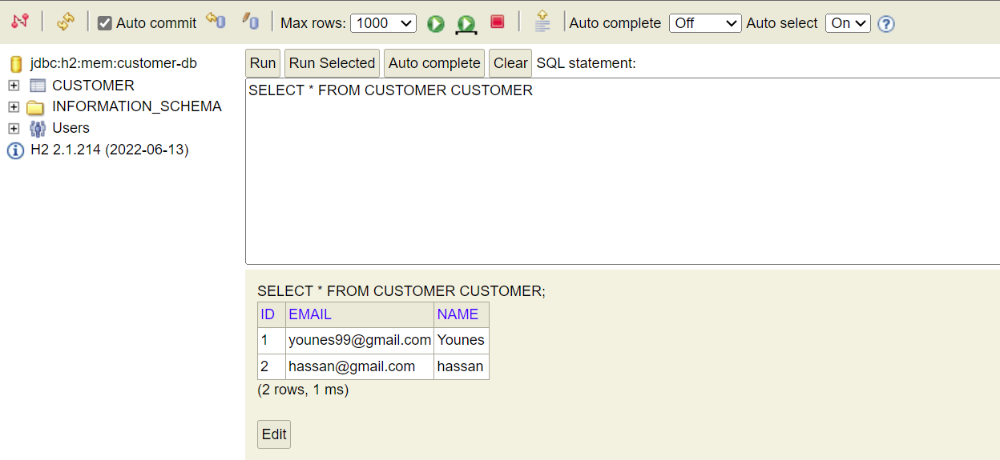
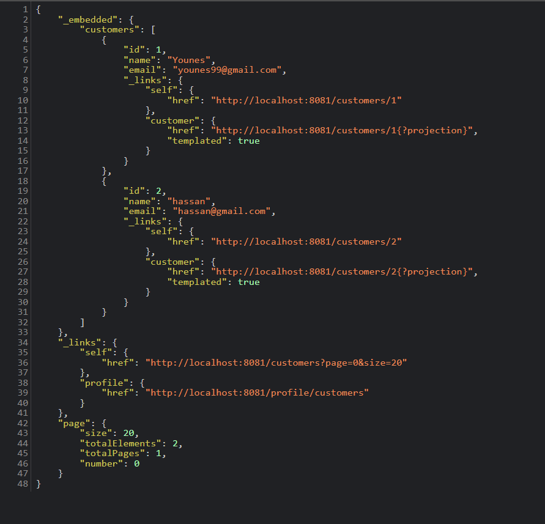
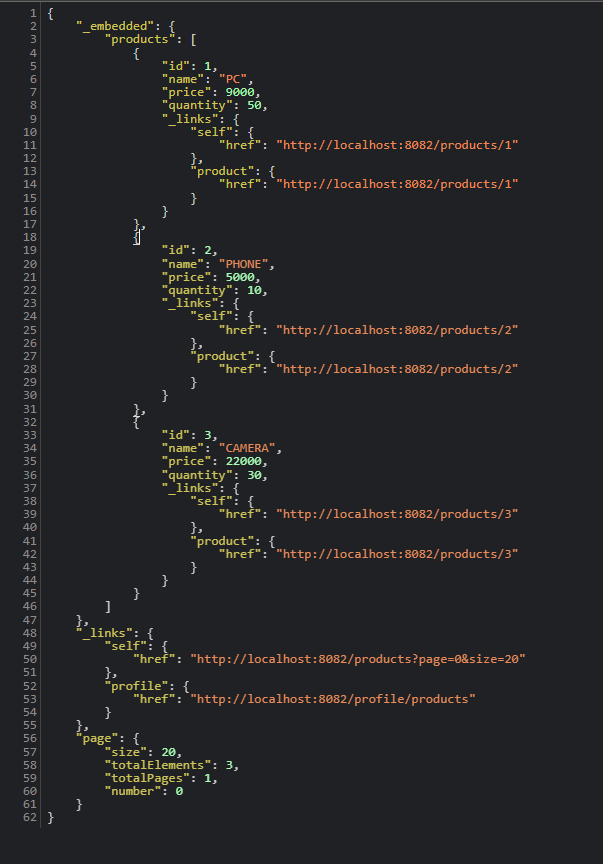
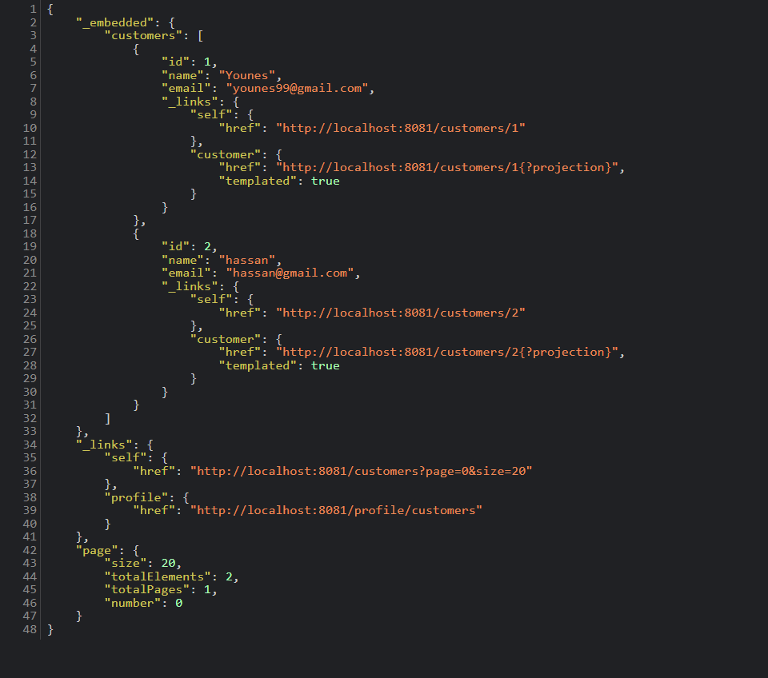
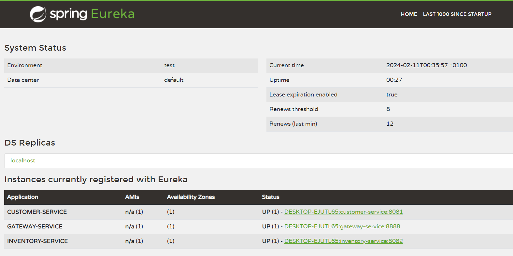
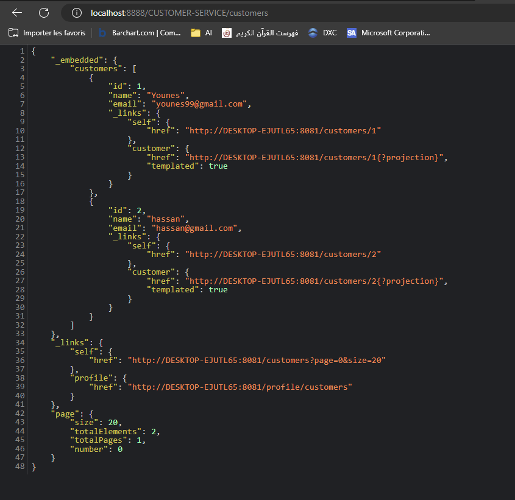
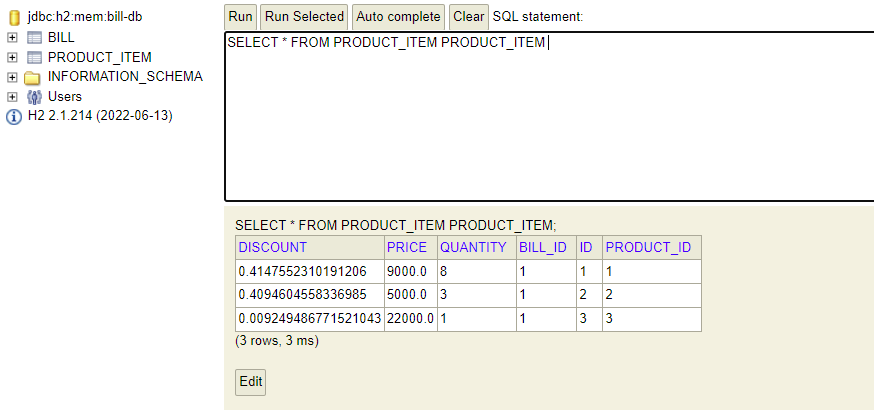
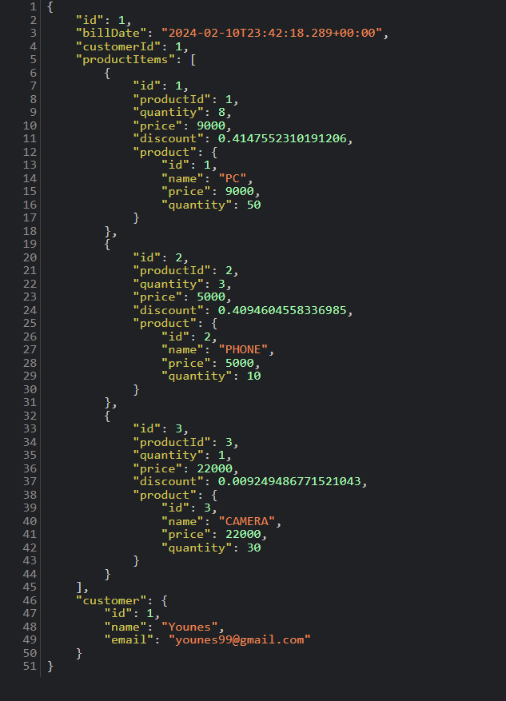

<h1>Younes</h1>
<h3>Activité Pratique N°3 : Mise en oeuvre d'une architecture micro-service avec Spring Cloud </h3>

 
<h2>Liste des clients</h2>

 
<h2>Liste des produits</h2>

<h2>Récuperation des clients à partir de la gateway</h2>

 
<h2>Interface Eureka contenant la liste des micro-services</h2>

<h2>Récuperation des données à partir des noms des mico-services</h2>

 
<h2>H2-console Bill</h2>

<h2>Détail de la facture</h2>

